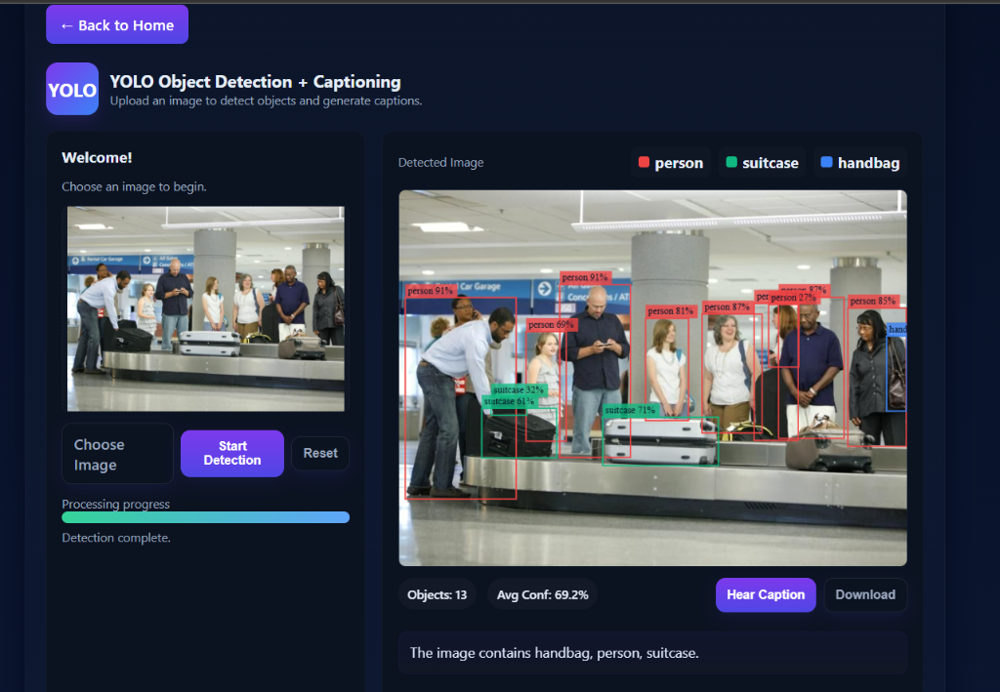
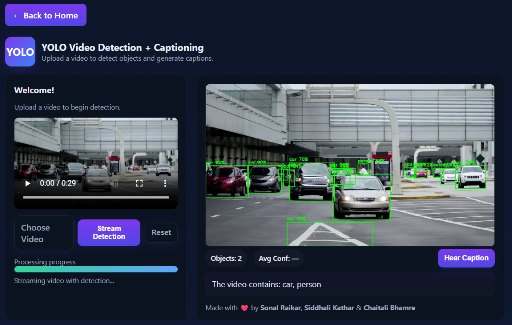
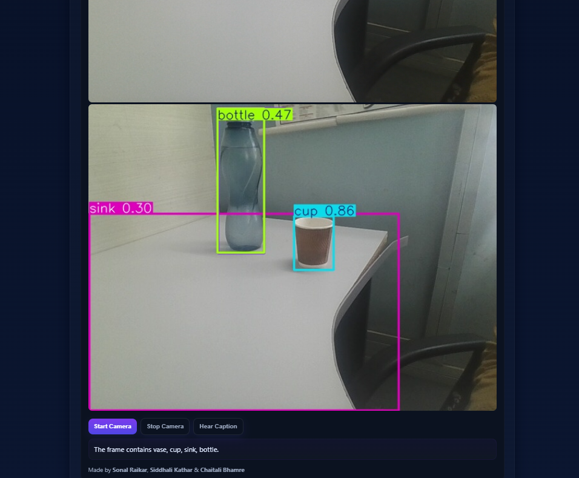

# 👁️ VISCRIBE: AI Object Detection & Caption Generation System.
**VISCRIBE** (Visual-Describe) is a state-of-the-art computer vision platform that leverages **YOLOv8** to detect objects in images, videos, and real-time streams, instantly generating descriptive AI captions.

---

## 🚀 Key Features

- **🖼️ Image Analysis**: Upload any image to get bounding boxes and a detailed textual description of the scene.
- **📹 Video Processing**: Real-time object tracking across video frames with cumulative scene summaries.
- **🎥 Live Detection**: Connect your webcam for instant, low-latency object recognition.
- **🤖 Powered by YOLOv8**: High-accuracy detection using the latest in neural network technology.

---

## 📸 Screenshots

| Image Detection | Video Tracking |
| :---: | :---: |
|  |  |

### 🎥 Real-time Detection
<p align="center">
  
</p>

---

## 🛠️ Tech Stack

- **Backend**: Python, Flask, Gunicorn
- **AI/ML**: Ultralytics (YOLOv8), OpenCV
- **Frontend**: HTML5 , CSS3 , JavaScript 
- **Deployment**: Render

---

## 💻 Local Setup

1. **Clone the Repo**:
   ```bash
   git clone https://github.com/siddhali24/VISCRIBE-project.git
   cd VISCRIBE-project
   ```

2. **Install Dependencies**:
   ```bash
   pip install -r requirements.txt
   ```

3. **Run the App**:
   ```bash
   python app.py
   ```
   *Access at `http://localhost:5000`*

---

## 👥 Contributors

-**Siddhali Kathar**; **Sonal Raikar** and **Chaitali Bhamre**. 
 